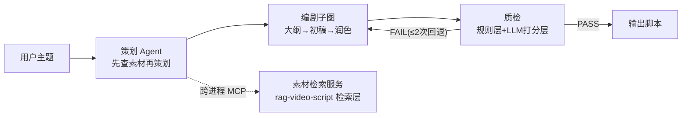

# 视频脚本 Agent 生产线（agent-video-script）

> 从 0 到 1：把「主题 → 60 秒视频口播脚本」自动化的多 Agent 生产线。
> 部署形态：LangGraph 多 Agent 流水线 + MCP 工具协议 + 两层质检，素材检索复用 rag-video-script 检索层。

## 架构



## 快速开始

前置：克隆 rag-video-script 并安装其依赖（检索服务复用其语料与 hybrid 检索）。

```bash
# 1. 检索服务依赖（llm 环境）
E:\Anaconda\envs\llm\python.exe -m pip install mcp

# 2. 主进程依赖
pip install langchain langchain-deepseek langgraph langchain-mcp-adapters python-dotenv

# 3. 运行（先确保 rag-video-script/material_server.py 存在）
python prototype_v02.py
```

## 设计决策（详见 docs/decisions.md）

| 决策 | 选择 | 理由 |
|---|---|---|
| 编排 | 父图固定流水线 + 编剧子图 | 生产流程强顺序，显式可控；子图封装编剧内部三步 |
| 质检 | 规则层(代码) + LLM 打分层(1-5) | LLM 硬判 PASS/FAIL 实测会标准漂移（详见博客） |
| 素材检索 | MCP 跨进程调用 | 环境隔离（检索=llm 环境，Agent=python3.11），复用已有检索层 |
| 回退 | ≤2 次后强制放行 | 防死循环烧 token |
| 模型分级 | 创作节点 deepseek-chat | 质量优先；本地模型可兜底 |

## 当前版本

- **v0.2（2026-08-25）✅ 端到端跑通**：策划（MCP 素材检索）→ 编剧子图 → 两层质检（首轮通过，规则 ✅ + 钩子 4/5）→ 回退环（校准后阈值一次通过）
- 设计决策与踩坑记录：`docs/decisions.md`
- 下一步（v1.0）：检索层内聚本项目（增量索引 + metadata 过滤）、成片规格结构化输出、Web UI、评估集（20 题 golden + 端到端成功率）

## 相关

- 素材检索层：[rag-video-script](https://github.com/HuaSheng-405/rag-video-script)（Recall@5=1.0 / MRR@5=0.87）
- 学习过程：[agent-learning](https://github.com/HuaSheng-405/agent-learning)（day01-11 实验）
