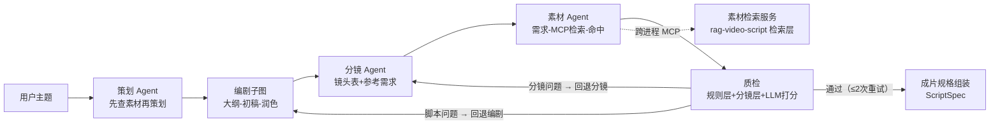

# 视频脚本 Agent 助手（agent-video-assistant）

> 面向知识创作者：给一个主题，自动产出「可进剪辑台的成片包」（口播脚本 + 分镜表 + 素材候选 + 成片规格）。
> 架构：LangGraph 五段式流水线 + MCP 工具协议 + 三层校验分级回退；素材双通道（文本 RAG 参考 + Pexels 视频）。

## 产品定位

**场景**：B 站 UP主 / 知识创作者想做一条科普/知识视频，被「写脚本 → 想分镜 → 找素材 → 剪辑」四道门劝退。

**解决**：把四道门压成两步——给个主题 → 选素材点导出；写脚本、分镜、素材检索全自动，人只做**判断与选择**。

**终态**：主题 → 60 秒成片包（脚本/分镜/素材候选/规格 JSON）→ **本地合成**（FFmpeg + TTS）为可发布 mp4。不依赖受限的厂商 API（剪映 API 不对个人开放，故用本地合成实现「从想法到成片」）。

## 架构（v1.1 五段式）



## 快速开始

前置：克隆 rag-video-script 并安装其依赖（检索服务复用其语料与 hybrid 检索）。

```bash
# 1. 检索服务依赖（llm 环境）
E:\Anaconda\envs\llm\python.exe -m pip install mcp

# 2. 主进程依赖
pip install langchain langchain-deepseek langgraph langchain-mcp-adapters python-dotenv

# 3. 运行（先确保 rag-video-script/material_server.py 存在）
python prototype_v02.py
```

## 设计决策（详见 docs/decisions.md）

| 决策 | 选择 | 理由 |
|---|---|---|
| 编排 | 五段式固定流水线 + 编剧子图 | 生产流程强顺序，显式可控；每段独立可评估（模块化：pipeline/agents_*.py） |
| 质检 | 规则层(代码) + 分镜层校验 + LLM 打分层(1-5) | LLM 硬判 PASS/FAIL 实测会标准漂移；三层校验汇入统一质检决策 |
| 回退 | 分级回退（脚本→编剧 / 分镜→分镜）+ ≤2 次强制放行 | 针对性回退省 token；防死循环烧钱 |
| 规格组装 | 生成与组装分离：LLM 只产文案字段，镜头表复用分镜 Agent 产物 | 让 LLM 重造镜头 = 重复劳动 + 不一致 + 校验波动（实测 3/20 失败） |
| 素材检索 | MCP 跨进程调用；语义=脚本参考片段/事实依据（视觉素材库 v1.2） | 环境隔离、复用已有检索层；设计先问「我有什么数据」 |
| 结构化输出 | 双通道降级（function_calling → 文本 JSON 解析） | 模型偶发不遵守 tool_call（返回 None 实测） |

## 评估（20 题端到端，`eval_run.py`）

| 指标 | v1.0 基线 | v1.0 改进 | **v1.1 五段式** | 关键改动 |
|---|---|---|---|---|
| 一次通过率 | 45% | 100% | **90%** | v1.0：字数硬约束；v1.1：新增分镜/素材环节 |
| 平均回退 | 0.70 次 | 0.00 次 | **0.10 次** | 分层回退（脚本→编剧/分镜→分镜） |
| 成片规格生成率 | 100% | 100% | **100%** | 双通道结构化输出 + 失败降级 |
| 规格校验通过率 | 95% | 100% | **100%** | 生成/组装分离（85%→100% 修复） |
| 平均耗时 | 136s | 137s | **252s** | v1.1.2 批量检索：N 次会话 → 1 次（-31%，无质量损失） |

> 评估驱动迭代闭环：基线 45% → 失败原因分析（字数超标为头号杀手）→ 针对性改进（硬约束）→ 复测 100%。数据见 `eval_result.json`。

## 当前版本

- **v1.1（2026-08-26）✅**：五段式模块化流水线（策划→编剧子图→分镜→素材→质检分层回退）→ 成片规格（生成/组装分离）；20 题端到端：一次通过率 90%、规格校验 100%
- 设计决策与踩坑记录：`docs/decisions.md`
- 已知限制：① 单轮样本数据，长期稳定性需多轮扩题验证 ② 文本素材检索与知识类需求存在固有语义边界（视频素材库 v1.2 补齐）

## v1.2 路线图（按用户价值排序，通向「主题 → 成片」终态）

1. **视觉素材检索**（Pexels API）：分镜 Agent 产出 `visual_keywords` → 每镜视频候选列表（结构化，供 UI 选择）
2. **本地合成**：下载选中素材 + TTS 口播 + FFmpeg 合成（配音/字幕/裁剪）→ 可发布 mp4（替代剪映 API——个人用户不可用）
3. **Web UI**：给主题 → 分镜表中穿插素材候选缩略图 → 用户点选 → 选择写回规格
4. 多轮上下文管理（checkpoint + SummarizationMiddleware）
5. LLM Proxy 统一网关（模型分级工程化）
6. 检索层内聚：增量索引 + metadata 过滤

## 相关

- 素材检索层：[rag-video-script](https://github.com/HuaSheng-405/rag-video-script)（Recall@5=1.0 / MRR@5=0.87）
- 学习过程：[agent-learning](https://github.com/HuaSheng-405/agent-learning)（day01-11 实验）
